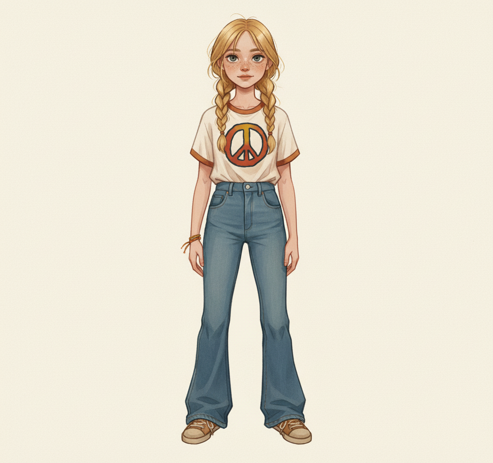
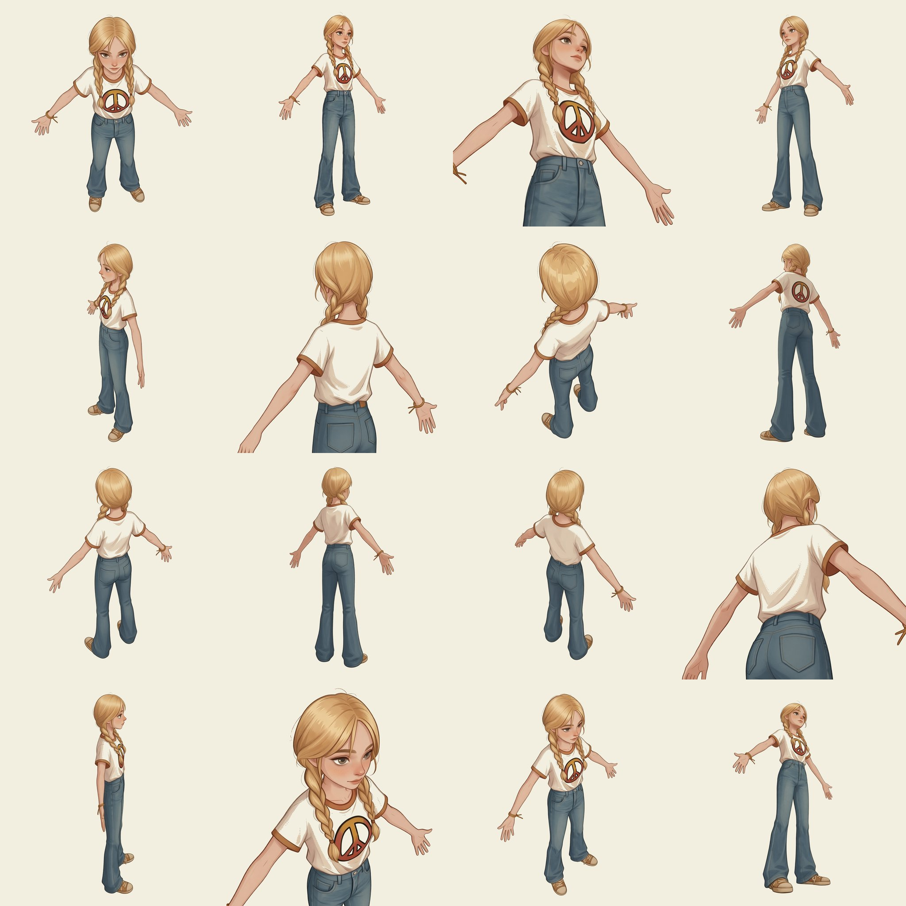
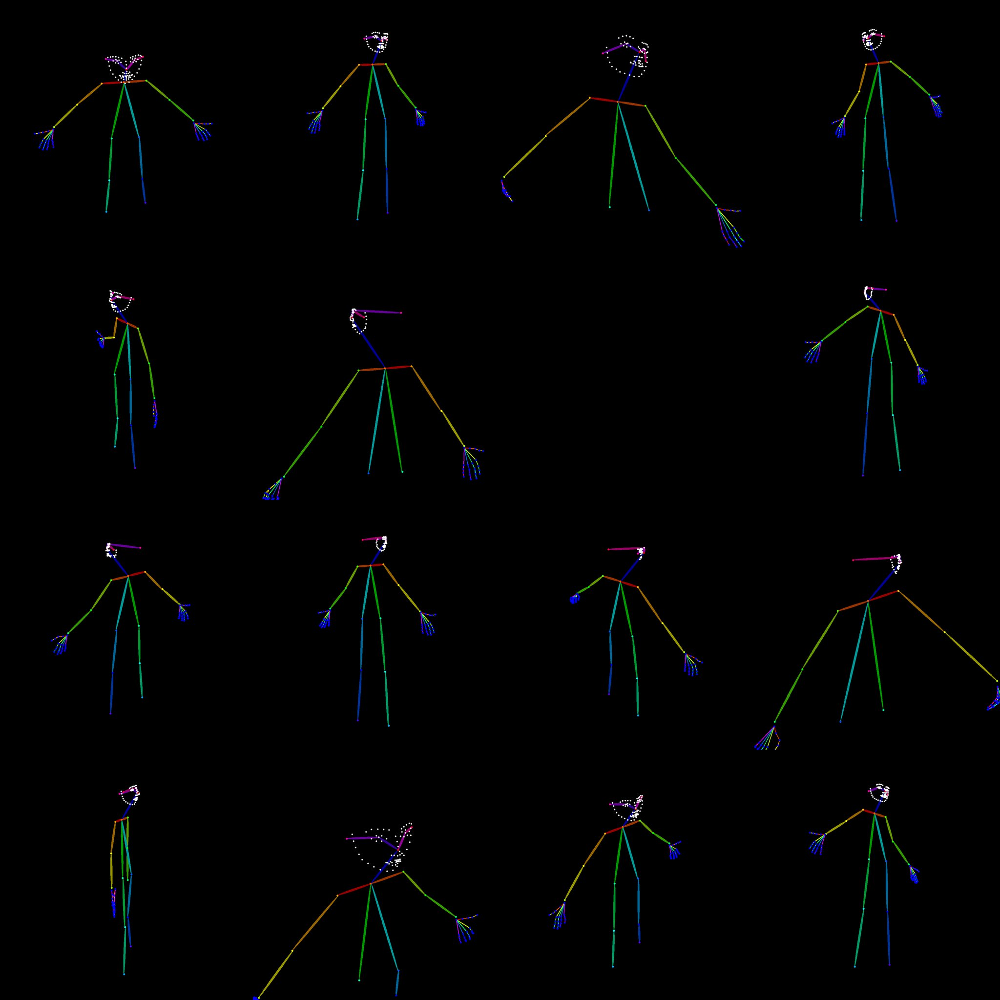
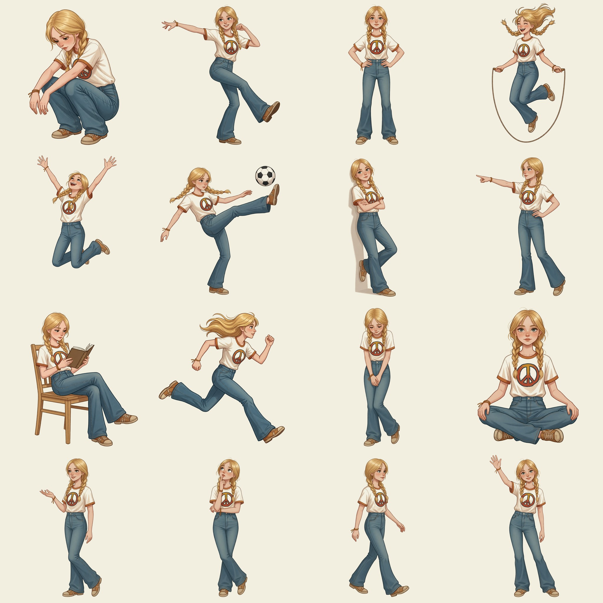
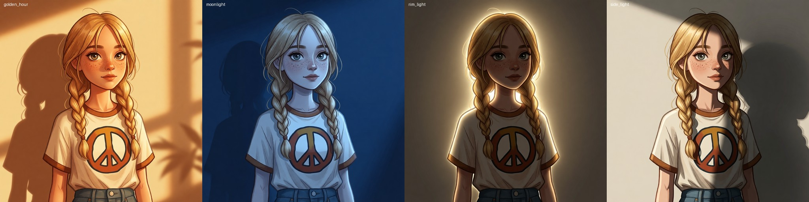
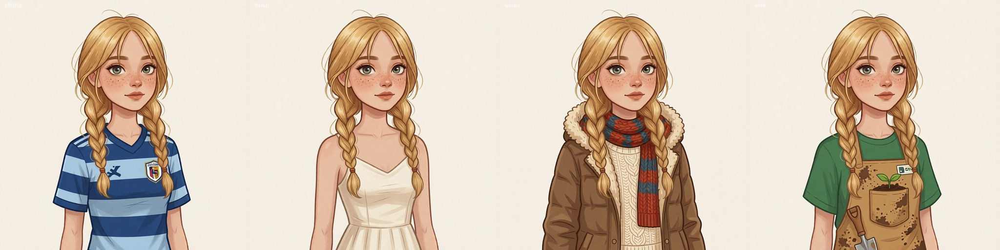
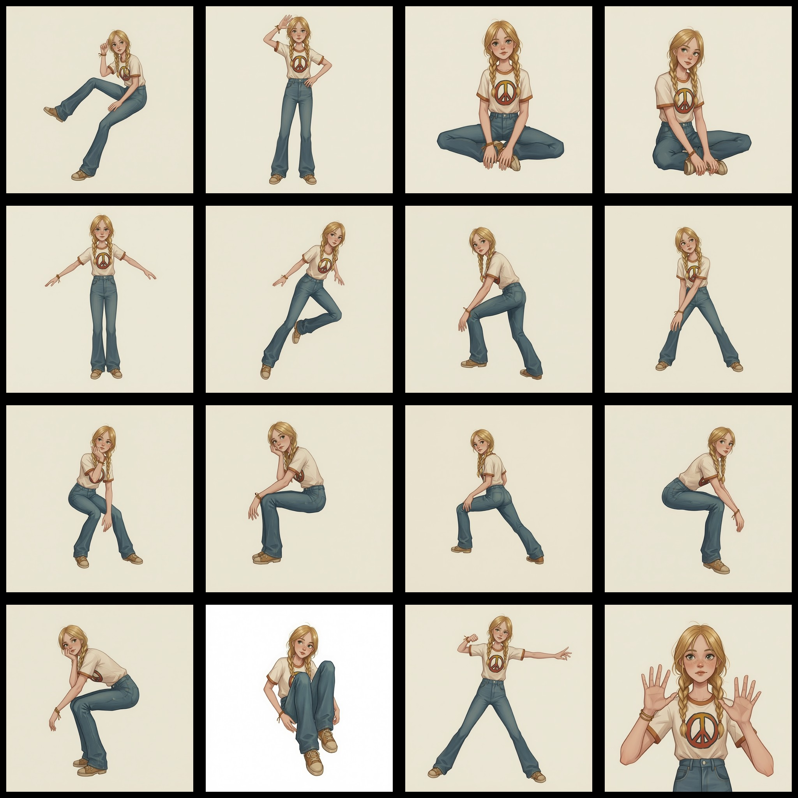

# Character Sheet Generator

Batch-render camera angle variations, pose transfers, and facial expression sheets from a single image using Qwen Image Edit models on [Comfy Cloud](https://cloud.comfy.org).

When training LoRAs or building character assets, you often need systematic multi-angle renders, posed variations, and expression sheets of a subject. Manually running ComfyUI workflows for every combination is tedious. This script automates the entire process — submit one image, get back a complete character sheet.

### Original



## Supported Pipelines

| Pipeline | LoRAs | Variations | Method |
|----------|-------|-----------|--------|
| **2511** (default) | [fal Multi-Angles](https://huggingface.co/fal/Qwen-Image-Edit-2511-Multiple-Angles-LoRA) | 96 (8 az x 4 el x 3 dist) | `QwenMultiangleCameraNode` |
| **2509** | [dx8152 Multi-Angles](https://huggingface.co/dx8152/Qwen-Edit-2509-Multiple-angles) | 72 (8 az x 3 el x 3 dist) | Bilingual text prompts |
| **anypose** | [lilylilith/AnyPose](https://huggingface.co/lilylilith/AnyPose) | Per pose image | Pose transfer from reference images |
| **poses_prompt** | Qwen-Image-Edit-2511 + Lightning | 16 poses | Prompt-driven body pose variations |
| **expressions** | Qwen-Image-Edit-2511 + Lightning | 16 emotions | Prompt-driven facial expression editing |
| **lighting** | Qwen-Image-Edit-2511 + Lightning | 4 variations | Prompt-driven lighting changes |
| **outfits** | Qwen-Image-Edit-2511 + Lightning | 4 variations | Prompt-driven outfit changes |

### Multi-Angle Grid (2511 / 2509)

- **Azimuths** (8): 0, 45, 90, 135, 180, 225, 270, 315 degrees
- **Elevations** (4 for 2511, 3 for 2509): -30, 0, 30, 60 degrees
- **Distances** (3): 0.6 (close-up), 1.0 (medium), 1.8 (wide)



### Skeleton Extraction (`--get-pose`)

When `--get-pose` is enabled, each rendered image is automatically run through DWPose extraction inline — no separate pass needed. Outputs include the skeleton visualization and a JSON file with all keypoints (body, face, hands).



Skeleton and JSON files are saved to a `poses/` subdirectory:

```
output_dir/
  az000_el+00_d1.0_front_view_eyelevel_shot_medium_shot.png
  poses/
    az000_el+00_d1.0_front_view_eyelevel_shot_medium_shot_skeleton.png
    az000_el+00_d1.0_front_view_eyelevel_shot_medium_shot_pose.json
```

The JSON contains OpenPose-format keypoints (18 body, 68 face, 21 per hand) which can be used for 3D triangulation, pose-driven generation, or ControlNet conditioning.

### Prompt Poses

Generates 16 body pose variations using text prompts only (no pose reference images needed). Each prompt describes specific limb positions, body angles, and activities.



### Expressions

Generates 16 facial expression variations from a single image using Qwen Image Edit 2511 with prompt-driven editing. Expressions include body language cues that carry the emotion. Included expressions: neutral, happy, laughing, smirk, sad, crying, angry, disgusted, surprised, fearful, confused, determined, flirty, contempt, embarrassed, sleepy.


### Lighting

Renders the character under different lighting conditions while preserving identity and pose.



### Outfits

Renders the character in different outfits while preserving identity and pose.



### Customizing Lighting & Outfit Prompts

The `lighting` and `outfits` pipelines ship with default prompts designed for the example character (a young girl in a peace sign t-shirt). **You should customize these prompts for your own character.** A soldier, a robot, or a fantasy elf would each need different outfit and lighting descriptions.

Edit the `LIGHTING` and `OUTFITS` dictionaries in `batch_multi_angle.py`:

```python
LIGHTING = {
    "rim_light":     "Change the lighting so a bright light source is ...",
    "side_light":    "Change the lighting to strong directional side lighting ...",
    "golden_hour":   "Change the lighting to warm golden hour sunlight ...",
    "moonlight":     "Change the lighting to cool blue moonlight ...",
}

OUTFITS = {
    "formal":        "Change the outfit to ...",
    "athletic":      "Change the outfit to ...",
    "winter":        "Change the outfit to ...",
    "work":          "Change the outfit to ...",
}
```

Add or remove entries as needed — the script will automatically generate one image per entry. Use `--dry-run` to preview all prompts before rendering.

## Included Pose Images

The `poses/` directory contains OpenPose skeleton images from [Pose Depot](https://github.com/pose-depot/pose-depot):

- `poses/F/` — 61 female pose variations
- `poses/M/` — 61 male pose variations

## Setup

```bash
pip install aiohttp Pillow numpy
export COMFY_CLOUD_API_KEY="your-key-here"  # from https://cloud.comfy.org
```

The required models and LoRAs must be available in your Comfy Cloud workspace.

## Usage

```bash
# Multi-angle: 2511 pipeline (default, 96 poses)
python batch_multi_angle.py --image photo.png --cloud

# Multi-angle: 2509 pipeline (72 poses)
python batch_multi_angle.py --image photo.png --cloud --pipeline 2509

# AnyPose: transfer poses from a directory of pose images
python batch_multi_angle.py --image photo.png --cloud --pipeline anypose --pose-dir ./poses/F

# Prompt poses: generate 16 body pose variations
python batch_multi_angle.py --image photo.png --cloud --pipeline poses_prompt

# Expressions: generate 16 facial expression variations
python batch_multi_angle.py --image photo.png --cloud --pipeline expressions

# Lighting: render under different lighting conditions
python batch_multi_angle.py --image photo.png --cloud --pipeline lighting

# Outfits: render in different outfits
python batch_multi_angle.py --image photo.png --cloud --pipeline outfits

# Different seed (output dir auto-named by pipeline + seed)
python batch_multi_angle.py --image photo.png --cloud --seed 123

# Append text to every prompt
python batch_multi_angle.py --image photo.png --cloud --prompt-append "dramatic lighting"

# Multi-angle with skeleton extraction
python batch_multi_angle.py --image photo.png --cloud --get-pose

# Render a subset of angles
python batch_multi_angle.py --image photo.png --cloud --azimuths 0,90,180,270 --elevations 0

# Preview all prompts without rendering
python batch_multi_angle.py --image photo.png --cloud --dry-run
```

## Options

| Flag | Default | Description |
|------|---------|-------------|
| `--image` | (required) | Input image path |
| `--cloud` | off | Use Comfy Cloud (otherwise targets local ComfyUI) |
| `--pipeline` | `2511` | `2509`, `2511`, `anypose`, `poses_prompt`, `expressions`, `lighting`, or `outfits` |
| `--pose-dir` | — | Directory of pose images (required for `anypose`) |
| `--output` | auto | Output directory (default: `./multi_angle_output_{pipeline}_seed{seed}`) |
| `--seed` | `42` | Random seed |
| `--steps` | `4` | Inference steps (Lightning LoRA tuned for 4) |
| `--guidance` | `1.0` | CFG scale |
| `--concurrency` | `3` | Parallel cloud jobs |
| `--lora-angles` | `1.0` | Angles LoRA strength |
| `--lora-lightning` | `1.0` | Lightning LoRA strength |
| `--azimuths` | all | Subset, e.g. `0,90,180,270` |
| `--elevations` | all | Subset, e.g. `-30,0,30` |
| `--distances` | all | Subset, e.g. `0.6,1.0` |
| `--prompt-append` | `""` | Text appended to every prompt |
| `--timeout` | `600` | Per-job timeout in seconds |
| `--get-pose` | off | Run DWPose extraction on each render (saves skeleton + JSON to `poses/` subdir) |
| `--dry-run` | off | Print prompts without rendering |

## Output

Images are saved with descriptive filenames:

```
# Multi-angle
az000_el+00_d1.0_front_view_eyelevel_shot_medium_shot.png
az090_el-30_d0.6_right_side_view_lowangle_shot_closeup.png

# AnyPose
pose_2F_Hand_on_Hip_OpenPoseFull.png
pose_15F_Flying_Superhero_OpenPoseFull_3.png

# Expressions
expr_happy.png
expr_surprised.png

# Lighting / Outfits
light_rim_light.png
outfit_work.png
```

Existing files are automatically skipped, so you can safely re-run to fill in any gaps.

## How It Works

1. Uploads the input image to Comfy Cloud
2. For AnyPose: detects reference background color, pre-processes pose images (background match + square padding)
3. Connects a WebSocket to receive real-time execution results
4. Submits all workflows with concurrency control
5. Downloads completed renders as they finish via WebSocket output events

### AnyPose

Transfers poses from reference images (OpenPose skeletons, photos, etc.) onto your subject using the [lilylilith/AnyPose](https://huggingface.co/lilylilith/AnyPose) LoRA. Pose images are automatically padded to square and background-matched to the reference image before upload.



## License

MIT
