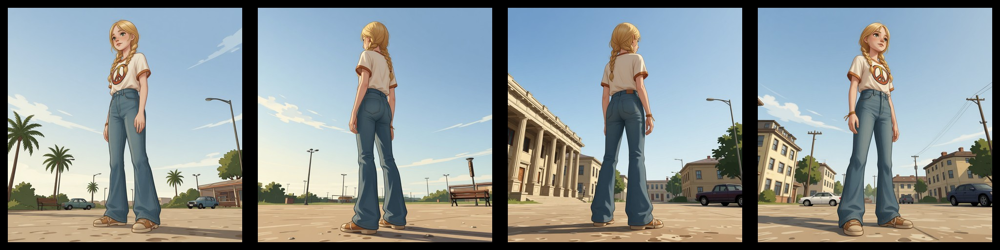

# Multi-Angle & Pose Batch Renderer

Batch-render camera angle variations and pose transfers from a single image using Qwen Image Edit models on [Comfy Cloud](https://cloud.comfy.org).

When training LoRAs or building 3D assets, you often need systematic multi-angle renders or posed variations of a subject. Manually running ComfyUI workflows for every combination is tedious. This script automates the entire process — submit one image, get back a complete set of variations.

### Original




## Supported Pipelines

| Pipeline | LoRAs | Variations | Method |
|----------|-------|-----------|--------|
| **2511** (default) | [fal Multi-Angles](https://huggingface.co/fal/Qwen-Image-Edit-2511-Multiple-Angles-LoRA) | 96 (8 az x 4 el x 3 dist) | `QwenMultiangleCameraNode` |
| **2509** | [dx8152 Multi-Angles](https://huggingface.co/dx8152/Qwen-Edit-2509-Multiple-angles) | 72 (8 az x 3 el x 3 dist) | Bilingual text prompts |
| **anypose** | [lilylilith/AnyPose](https://huggingface.co/lilylilith/AnyPose) | Per pose image | Pose transfer from reference images |

### Multi-Angle Grid (2511 / 2509)

- **Azimuths** (8): 0, 45, 90, 135, 180, 225, 270, 315 degrees
- **Elevations** (4 for 2511, 3 for 2509): -30, 0, 30, 60 degrees
- **Distances** (3): 0.6 (close-up), 1.0 (medium), 1.8 (wide)


### AnyPose

Transfers poses from reference images (OpenPose skeletons, photos, etc.) onto your subject. Pose images are automatically padded to square and background-matched to the reference image before upload.


## Included Pose Images

The `poses/` directory contains OpenPose skeleton images from [Pose Depot](https://github.com/pose-depot/pose-depot):

- `poses/F/` — 61 female pose variations
- `poses/M/` — 61 male pose variations

## Setup

```bash
pip install aiohttp Pillow numpy
export COMFY_CLOUD_API_KEY="your-key-here"  # from https://cloud.comfy.org
```

The required models and LoRAs must be available in your Comfy Cloud workspace.

## Usage

```bash
# Multi-angle: 2511 pipeline (default, 96 poses)
python batch_multi_angle.py --image photo.png --cloud

# Multi-angle: 2509 pipeline (72 poses)
python batch_multi_angle.py --image photo.png --cloud --pipeline 2509

# AnyPose: transfer poses from a directory of pose images
python batch_multi_angle.py --image photo.png --cloud --pipeline anypose --pose-dir ./poses/F

# Different seed (output dir auto-named by pipeline + seed)
python batch_multi_angle.py --image photo.png --cloud --seed 123

# Append text to every prompt
python batch_multi_angle.py --image photo.png --cloud --prompt-append "dramatic lighting"

# Render a subset of angles
python batch_multi_angle.py --image photo.png --cloud --azimuths 0,90,180,270 --elevations 0

# Preview all prompts without rendering
python batch_multi_angle.py --image photo.png --cloud --dry-run
```

## Options

| Flag | Default | Description |
|------|---------|-------------|
| `--image` | (required) | Input image path |
| `--cloud` | off | Use Comfy Cloud (otherwise targets local ComfyUI) |
| `--pipeline` | `2511` | `2509`, `2511`, or `anypose` |
| `--pose-dir` | — | Directory of pose images (required for `anypose`) |
| `--output` | auto | Output directory (default: `./multi_angle_output_{pipeline}_seed{seed}`) |
| `--seed` | `42` | Random seed |
| `--steps` | `4` | Inference steps (Lightning LoRA tuned for 4) |
| `--guidance` | `1.0` | CFG scale |
| `--concurrency` | `3` | Parallel cloud jobs |
| `--lora-angles` | `1.0` | Angles LoRA strength |
| `--lora-lightning` | `1.0` | Lightning LoRA strength |
| `--azimuths` | all | Subset, e.g. `0,90,180,270` |
| `--elevations` | all | Subset, e.g. `-30,0,30` |
| `--distances` | all | Subset, e.g. `0.6,1.0` |
| `--prompt-append` | `""` | Text appended to every prompt |
| `--timeout` | `600` | Per-job timeout in seconds |
| `--dry-run` | off | Print prompts without rendering |

## Output

Images are saved with descriptive filenames:

```
# Multi-angle
az000_el+00_d1.0_front_view_eyelevel_shot_medium_shot.png
az090_el-30_d0.6_right_side_view_lowangle_shot_closeup.png

# AnyPose
pose_2F_Hand_on_Hip_OpenPoseFull.png
pose_15F_Flying_Superhero_OpenPoseFull_3.png
```

Existing files are automatically skipped, so you can safely re-run to fill in any gaps.

## How It Works

1. Uploads the input image to Comfy Cloud
2. For AnyPose: detects reference background color, pre-processes pose images (background match + square padding)
3. Connects a WebSocket to receive real-time execution results
4. Submits all workflows with concurrency control
5. Downloads completed renders as they finish via WebSocket output events

## License

MIT
